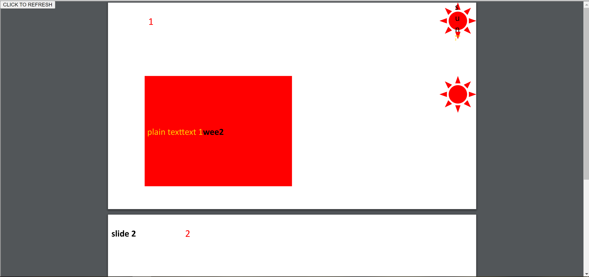

# pptx-renderer
React Renderer for creating Powerpoint File with React. 
It is a [PPTXJS](https://gitbrent.github.io/PptxGenJS/) binding for react


## Usage
### Required commands before starting
```
corepack enable
yarn dlx @yarnpkg/sdks vscode
```

### Commands

```
yarn run build
yarn run start:demo
```


### Demo

It is a React App with a Button. You click on it and a PDF will display a preview.
Internally it uses `libreoffice`. Please check it is installed on your machine.


## CircleCI
[](https://app.circleci.com/pipelines/github/marcog83/pptx-renderer) 